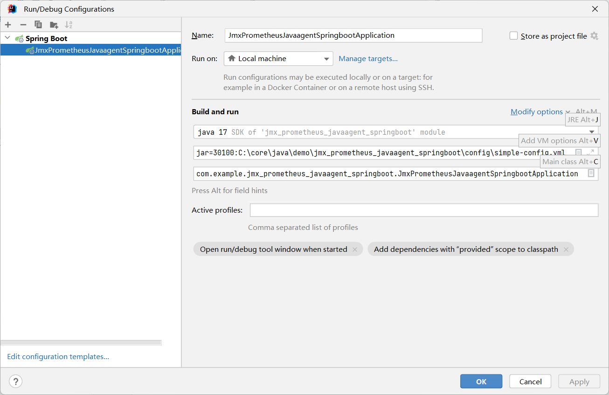

# 运行方式

## 下载


```
-javaagent:C:\core\java\demo\jmx_prometheus_javaagent_springboot\config\jmx_prometheus_javaagent-0.20.0.jar=30100:C:\core\java\demo\jmx_prometheus_javaagent_springboot\config\simple-config.yml 
```

```

javaagent:C:\core\java\demo\jmx_prometheus_javaagent_springboot\config\jmx_prometheus_javaagent-0.20.0.jar=30100 表示 JMX Exporter 的代理端口为30100
C:\core\java\demo\jmx_prometheus_javaagent_springboot\config\simple-config.yml 表示 JMX Exporter 的配置文件
```



